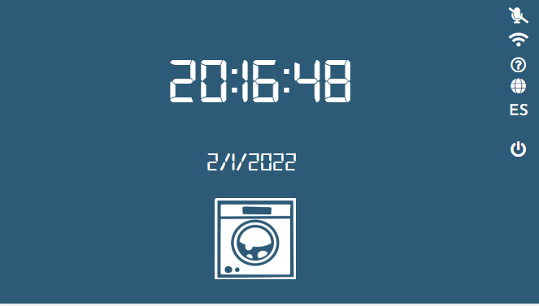
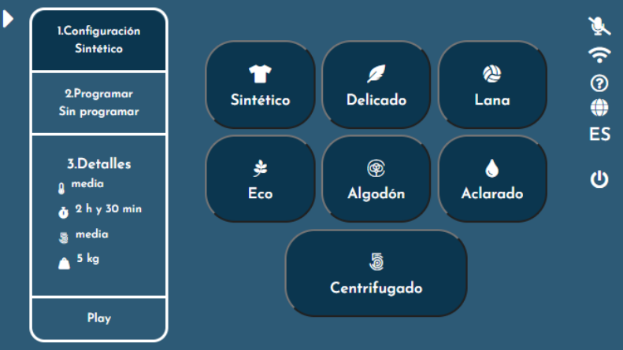
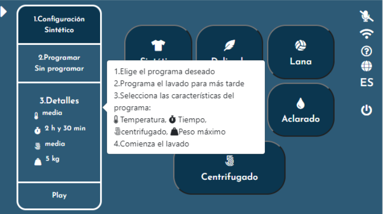
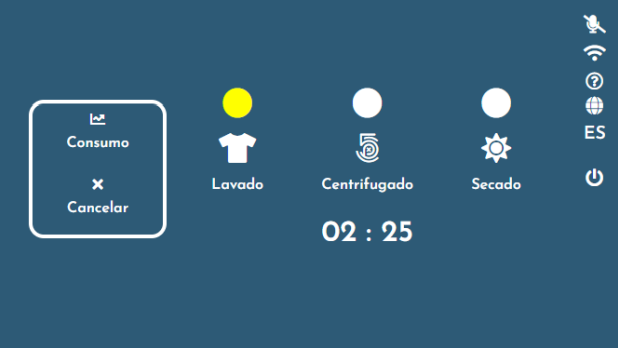

# Interfaz de lavadora para la asignatura accesibilidad y usabilidad

Imagenes del proyecto:
 

El servidor está implementado con NodeJS.

* Instalar NodeJS en el equipo desde https://nodejs.org/
* Desde la carpeta 'servidor' ejecutar:

  npm install

  Esto instalará las librerias que necesita el emulador: 'express' y 'websocket'

Iniciar el servidor
-------------------

Cada vez que se quiera iniciar el servidor, desde la carpeta 'servidor' ejecutar:

node .

Esto lanzará el servidor en el puerto 8080.
Si se desea lanzar otro puerto utilizar la opción '-p <puerto>':

node . -p 3000

Se podrá acceder a la web desde la propia máquina en la dirección:

http://localhost:8080/

